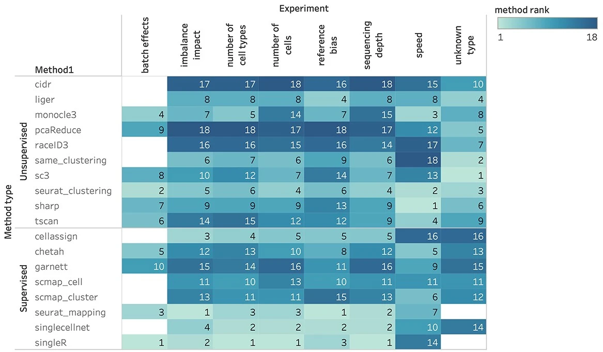
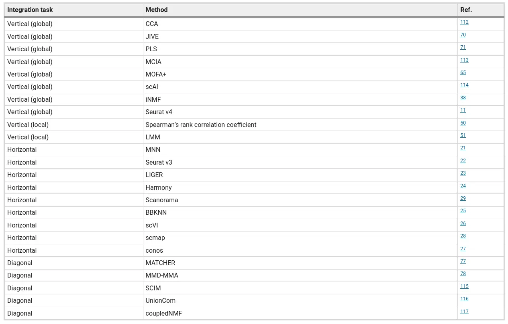
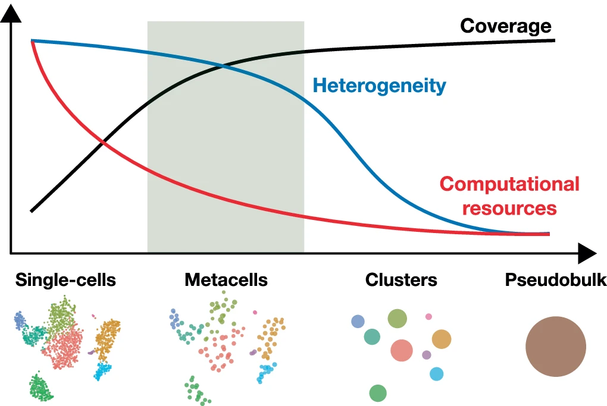
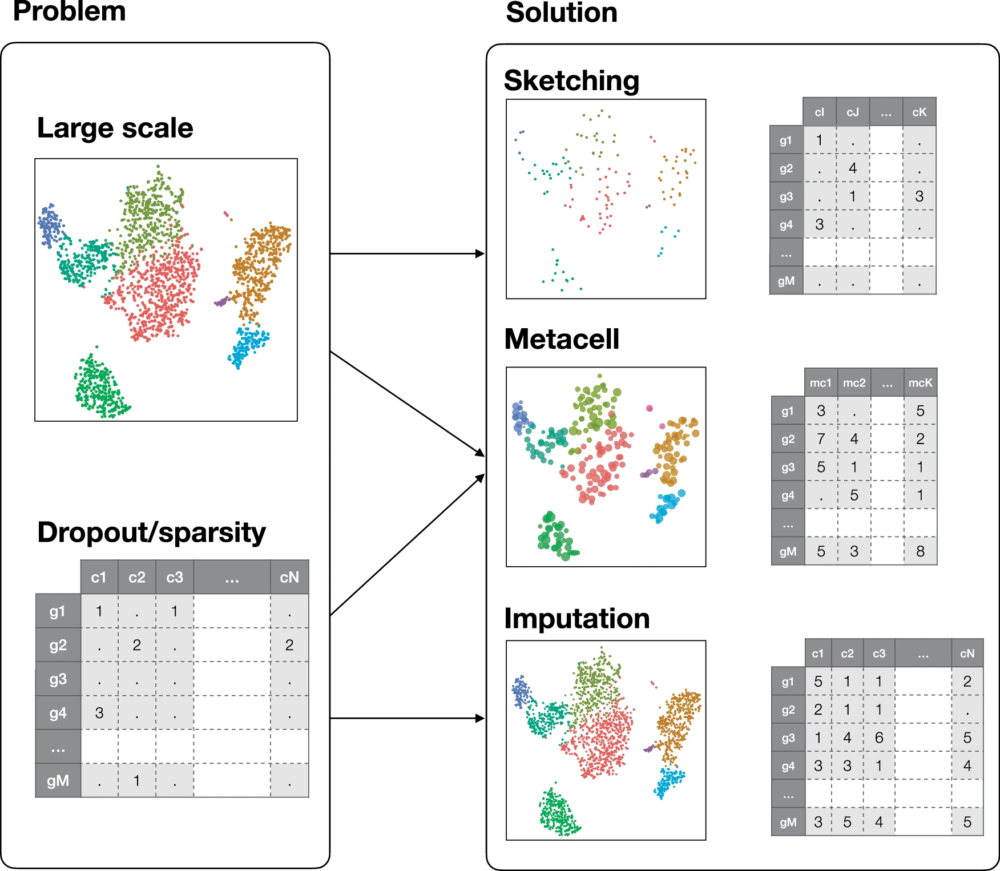
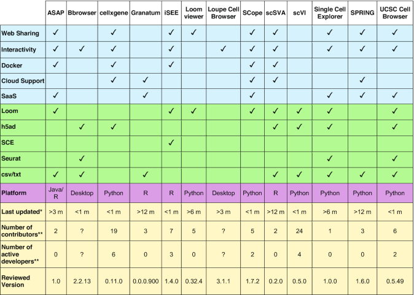

## Overview {#sc-overview}

**Current best practices in scRNA-Seq**

- Perform QC by finding outlier peaks in the number of genes, the count depth and the fraction of mitochondrial reads. Consider these covariates jointly instead of separately.
- Be as permissive of QC thresholding as possible, and revisit QC if downstream clustering cannot be interpreted.
- If the distribution of QC covariates differ between samples, QC thresholds should be determined separately for each sample to account for sample quality differences
- We recommend scran for normalization of non-full-length datasets. An alternative is to evaluate normalization approaches via scone especially for plate-based datasets. Full-length scRNA-seq protocols can be corrected for gene length using bulk methods.
- There is no consensus on scaling genes to 0 mean and unit variance. We prefer not to scale gene expression.
- Normalized data should be log(x+1)-transformed for use with downstream analysis methods that assume data are normally distributed.
- Regress out biological covariates only for trajectory inference and if other biological processes of interest are not masked by the regressed out biological covariate.
- Regress out technical and biological covariates jointly rather than serially.
- Plate-based dataset pre-processing may require regressing out counts, normalization via non-linear normalization methods or downsampling.
- We recommend performing batch correction via ComBat when cell type and state compositions between batches are consistent
- Data integration and batch correction should be performed by different methods. Data integration tools may over-correct simple batch effects.
- Users should be cautious of signals found only after expression recovery. Exploratory analysis may be best performed without this step.
- We recommend selecting between 1,000 and 5,000 highly variable genes depending on dataset complexity.
- Feature selection methods that use gene expression means and variances cannot be used when gene expression values have been normalized to zero mean and unit variance, or when residuals from model fitting are used as normalized expression values. Thus, one must consider what pre-processing to perform before selecting HVGs.
- Dimensionality reduction methods should be considered separately for summarization and visualization.
- We recommend UMAP for exploratory visualization; PCA for general purpose summarization; and diffusion maps as an alternative to PCA for trajectory inference summarization.
- PAGA with UMAP is a suitable alternative to visualize particularly complex datasets.
- Use measured data for statistical testing, corrected data for visual comparison of data and reduced data for other downstream analysis based on finding the underlying biological data manifold.
- We recommend clustering by Louvain community detection on a single-cell KNN graph.
- Clustering does not have to be performed at a single resolution. Subclustering particular cell clusters is a valid approach to focus on more detailed substructures in a dataset.
- Do not use marker gene P-values to validate a cell-identity cluster, especially when the detected marker genes do not help to annotate the community. P-values may be inflated.
- Note that marker genes for the same cell-identity cluster may differ between datasets purely due to dataset cell type and state compositions.
- If relevant reference atlases exist, we recommend using automated cluster annotation combined with data-derived marker-gene-based manual annotation to annotate clusters.
- Consider that statistical tests over changes in the proportion of a cell-identity cluster between samples are dependent on one another.
- Inferred trajectories do not have to represent a biological process. Further sources of evidence should be collected to interpret a trajectory.
- DE testing should not be performed on corrected data (denoised, batch corrected, etc.), but instead on measured data with technical covariates included in the model.
- Users should not rely on DE testing tools to correct models with confounded covariates. Model specification should be performed carefully ensuring a full-rank design matrix.
- We recommend using MAST or limma for DE testing.
- Users should be wary of uncertainty in the inferred regulatory relationships. Modules of genes that are enriched for regulatory relationships will be more reliable than individual edges.

@luecken2019current

**Best practices for single-cell analysis across modalities**

@heumos2023best

**What information should be included in an scRNA-Seq publication?**

@fullgrabe2020guidelines

**Open problems in single-cell analysis**

@luecken2025defining

## Experimental design {#sc-exp-design}

**Experimental Considerations for Single-Cell RNA Sequencing Approaches**


@nguyen2018experimental

**How many reads are needed per cell? Sequencing depth?**

> Given a fixed budget, sequencing as many cells as possible at approximately one read per cell per gene is optimal, both theoretically and experimentally.

@zhang2020determining

- [ scDesign (R)](https://github.com/Vivianstats/scDesign) @li2019statistical

### Batch design, number of cells

**Avoid technical biases.**


**Deciding appropriate cell numbers**


@baran2018experimental

- [ SatijaLab Cells Calculator](https://satijalab.org/howmanycells/)
- [ SCOPIT](https://alexdavisscs.shinyapps.io/scs_power_multinomial/) (Shiny app)
- [ powsimR (R)](https://github.com/bvieth/powsimR)

### Sequencing depth

> While 250 000 reads per cell are sufficient for accuracy, 1 million reads per cell were a good target for saturated gene detection.

@svensson2017power

- [ Compare 10X QC reports](https://10xqc.com/)
- SatijaLab [ Cost Per Cell Calculator](https://satijalab.org/costpercell/)

## Methods and kits {#methods-kits}

Common methods for single-cell RNA-seq are based on microfluidics, droplets, microwells, or FACS sorting into plates. The most popular platforms are 10X Genomics Chromium, Drop-seq, inDrop, Seq-Well, and SMART-seq2/3. Parse has recently emerged as a new droplet-based platform.

Droplet based methods are high-throughput and cost-effective, but they typically capture only the 3' or 5' end of transcripts and have lower sensitivity per cell. Plate-based methods like SMART-seq2/3 provide full-length transcript coverage and higher sensitivity but are lower throughput and more expensive per cell.

How do 10X Genomics and Parse compare?

- Hardware/cost: 10x needs a Chromium Controller; Parse doesn’t (lower setup cost) but is more hands‑on. 10x prone to GEM wetting/clogging; Parse avoids this.
- Workflow: 10x ≈3 days and more flexible; Parse ≥4 days with a long uninterrupted day. Parse supports fixation/storage without extra hardware; 10x fixation needs another instrument.
- Multiplexing: Built‑in with Parse; 10x requires add‑on reagents/steps (e.g., hashing).
- Input/recovery: Parse needs ≥100k cells/sample; 10x can run ~800 cells. 10x generally higher, more consistent recovery—better for rare populations.
- Read composition/ambient RNA: Parse slightly higher mitochondrial %; 10x much higher ribosomal/lncRNA (more ambient RNA). Parse washes reduce ambient RNA.
- Doublets: This study—10x with hashing ~14%; Parse ~31% (WT) and ~21% (mini); literature mixed by tissue.
- Sensitivity/reproducibility: Parse detects ~2× more genes at similar depth but shows higher variability and batch effects; 10x more reproducible and simpler downstream (less batch correction).
- Cell‑type resolution (thymus): 10x cleanly resolves major subsets and DP subtypes; Parse struggled (aberrant Cd3d/Cd3g, missed DP‑A, poor SP‑CD4 vs SP‑CD8 separation).
- Bottom line: Choose 10x for reliability, recovery, and annotation with low input; choose Parse for no instrument, integrated multiplexing, fixation flexibility, and higher gene detection at the cost of longer workflow and variable data.

@filippov2024comparative

- Overall: Both produced high-quality PBMC data with consistent replicates.
- Efficiency: 10x ≈2× higher cell recovery and ~13% more valid reads; Parse needs more input and deeper sequencing (more invalid barcodes).
- Multiplets/QC: Parse had lower multiplet rates → fewer cells discarded than 10x.
- Sensitivity (20k reads/cell): Parse detected ~1.2× more genes in T/NK/B; no advantage in monocytes.
- Biases: 10x enriched for ribosomal protein-coding genes; 10x GC bias varies by chemistry.
- Downstream: Parse improved clustering/rare-cell detection but showed weaker marker-gene expression—reference-based annotation recommended.
- Use-cases: Parse for high-throughput multiplexing and low-expression genes; 10x for higher recovery/valid reads and robust marker quantification; overall quality comparable.

## Mapping and Quantification {#mapping}
### CellRanger

- Process chromium data
- BCL to FASTQ
- FASTQ to cellxgene counts
- Feature barcoding

- [ CellRanger](https://support.10xgenomics.com/single-cell-gene-expression/software/pipelines/latest/what-is-cell-ranger)

### Kallisto Bustools

- 10x, inDrop and Dropseq
- Generate cellxgene, cellxtranscript matrix
- RNA velocity data
- Feature barcoding
- QC reports

- [ BUSTools](https://bustools.github.io/)

@melsted2019modular

### Salmon Alevin

- Drop-seq, 10x-Chromium v1/2/3, inDropV2, CELSeq 1/2, Quartz-Seq2, sci-RNA-seq3
- Generate cellxgene matrix
- [ Alevin](https://salmon.readthedocs.io/en/latest/alevin.html)

### Nextflow nf-core rnaseq

- Bulk RNA-Seq, SMART-Seq
- QC, trimming, UMI demultiplexing, mapping, quantification
- cellxgene matrix
- [ nf-core scrnaseq](https://nf-co.re/scrnaseq)

## Background correction

Identification and correction for free RNA background contamination in single-cell RNA-seq data.

![Accuracy of computational background noise estimation. A Estimated background noise levels per cell based on genetic variants (gray) and different computational tools. B Taking the genotype-based estimates as ground truth, Root Mean Squared Logarithmic Error (RMSLE) and Kendall rank correlation serve as evaluation metrics for cell-wise background noise estimates of different methods. Low RMSLE values indicate high similarity between estimated values and the assumed ground truth. High values of Kendall’s correspond to good representation of cell to cell variability in the estimated values](assets/janssen-2023-1.webp)

@janssen2023effect

**Tools**

- [ SoupX](https://github.com/constantAmateur/SoupX) (R)
- [ decontX](https://www.bioconductor.org/packages/release/bioc/html/decontX.html) (R)
- [ CellBender](https://github.com/broadinstitute/CellBender) (Python)

CellBender is slow when using CPU.

## Doublet detection


The methods include doubletCells, Scrublet, cxds, bcds, hybrid, Solo, DoubletDetection, DoubletFinder, and DoubletDecon. Evaluation was conducted using 16 real scRNA-seq datasets with experimentally annotated doublets and 112 synthetic datasets.

- **Evaluation Metrics**
  - Detection Accuracy: Assessed using the area under the precision-recall curve (AUPRC) and the area under the receiver operating characteristic curve (AUROC).
  - Impact on Downstream Analyses: Effects on differential expression (DE) gene analysis, highly variable gene identification, cell clustering, and cell trajectory inference.
  - Computational Efficiency: Considered aspects such as speed, scalability, stability, and usability.
- **Key Findings**
  - Detection Accuracy: DoubletFinder achieved the highest detection accuracy among the methods.
  - Downstream Analyses: Removal of doublets generally improved the accuracy of downstream analyses, with varying degrees of improvement depending on the method.
  - Computational Efficiency: cxds was found to be the most computationally efficient method, particularly excelling in speed and scalability.
- **Performance Factors**
  - Doublet Rate: Higher doublet rates improved the accuracy of all methods.
  - Sequencing Depth: Greater sequencing depth led to better performance.
  - Number of Cell Types: More cell types generally resulted in better detection accuracy, except for cxds, bcds, and hybrid methods.
  - Cell-Type Heterogeneity: Higher heterogeneity between cell types improved the detection accuracy for most methods.

Overall Conclusion: DoubletFinder is recommended for its high detection accuracy and significant improvement in downstream analyses, while cxds is highlighted for its computational efficiency.

@xi2021benchmarking

For 10X data, the expected odublet rate is 0.8% per 1000 cells for 10x 3’ CellPlex kit and 0.4% per 1000 cells for high-throughput (HT) 3' v3.1 assay [a](https://kb.10xgenomics.com/hc/en-us/articles/360001378811-What-is-the-maximum-number-of-cells-that-can-be-profiled), [b](https://kb.10xgenomics.com/hc/en-us/articles/360054599512-What-is-the-cell-multiplet-rate-when-using-the-3-CellPlex-Kit-for-Cell-Multiplexing).

The doublet rate is 3% per 100,000 cells for Parse WT kit as mentioned [here](https://support.parsebiosciences.com/hc/en-us/articles/360053107311-What-is-the-expected-doublet-rate).

::: {.content-hidden}

```
library(ggplot2)
library(dplyr)

dfr <- data.frame(
  rate = c(0.4, 0.8, 1.6, 2.4, 3.2, 4.0, 4.8, 5.6, 6.4, 7.2, 8.0),
  cells_loaded = c(825, 1650, 3300, 4950, 6600, 8250, 9900, 11550, 13200, 14850, 16500),
  cells_recovered = c(500, 1000, 2000, 3000, 4000, 5000, 6000, 7000, 8000, 9000, 10000)
) %>%
  mutate(doublets_by_count = cells_loaded - cells_recovered) %>%
  mutate(doublets_by_rate = (rate / 100 * cells_loaded)) %>%
  mutate(estimated_rate = round(100 - ((cells_recovered / cells_loaded) * 100)))

ggplot(dfr, aes(cells_loaded, cells_recovered)) +
  geom_point() +
  geom_smooth(method = "lm")
```

:::

| rate| cells_loaded| cells_recovered|
|----:|------------:|---------------:|
|  0.4|          825|             500|
|  0.8|         1650|            1000|
|  1.6|         3300|            2000|
|  2.4|         4950|            3000|
|  3.2|         6600|            4000|
|  4.0|         8250|            5000|
|  4.8|         9900|            6000|
|  5.6|        11550|            7000|
|  6.4|        13200|            8000|
|  7.2|        14850|            9000|
|  8.0|        16500|           10000|

- [ scDBlFinder](https://bioconductor.org/packages/release/bioc/vignettes/scDblFinder/inst/doc/scDblFinder.html) (R)
- [ DoubletFinder](https://github.com/chris-mcginnis-ucsf/DoubletFinder) (R)
- [ Scrublet](https://github.com/swolock/scrublet) (Python)

## Cell type prediction


- Benchmarked **22** supervised classification methods for automatic cell identification in scRNA-seq, including both single-cell-specific tools and general-purpose ML classifiers.
- Used **27** public scRNA-seq datasets spanning different sizes, technologies, species, and annotation complexity.
- Evaluated two main scenarios: within-dataset (intra-dataset) and across-dataset (inter-dataset) prediction.
- Scored methods by accuracy, fraction of unclassified cells, and computation time, and also tested sensitivity to feature selection and number of cells per population.
- Found most methods perform well broadly, but accuracy drops for complex datasets with overlapping classes or very fine ("deep") annotation levels.
- Reported that a general-purpose **support vector machine (SVM)** achieved the best overall performance across their experiments.
- Released code and a Snakemake workflow to reproduce/extend the benchmark (new methods and datasets).

@abdelaal2019comparison

Identification of cell types can be completely automated (by comparing to reference data/databases) or semi-automated (reference data + marker genes).


- Compares 32 methods using common performance criteria such as prediction accuracy, F1-score, "unlabeling" rate (cells left unassigned), and computational efficiency. 
- Organizes methods by major strategy families, including marker/gene-set–based approaches, reference-based label transfer, and supervised machine-learning classifiers. 
- Highlights that method performance is dataset-dependent, with challenges increasing when cell types are highly similar, labels are very fine-grained, or references are incomplete. 
- Emphasizes practical selection factors beyond accuracy, especially whether a method can leave cells "unknown/unassigned," how sensitive it is to batch effects, and how well it scales to large datasets.

@xie2021automatic



- Compared 8 supervised and 10 unsupervised scRNA-seq cell type identification methods across 14 real public datasets (different tissues, protocols, species).
- Main result: supervised methods usually outperform unsupervised methods, except when the goal is identifying unknown/novel cell types (where unsupervised tends to do better).
- Supervised methods work best when the reference is high-quality, low-complexity, and similar to the query; performance drops as reference bias increases (different individuals/conditions/batches/species).
- Dataset complexity is a major driver: when complexity is low, supervised wins clearly; when complexity is high, supervised vs unsupervised performance becomes more similar and can even reverse under strong reference bias.
- More training cells generally improve supervised performance until a saturation point; unsupervised results can vary strongly with sample size because cluster-number estimation changes with dataset size.
- Sequencing depth helps both categories up to a saturation point; deeper data improves results most when baseline depth is low.
- Batch-effect correction was often not necessary and could hurt performance; most supervised methods did not improve after correction, with CHETAH being a notable exception due to fewer "unassigned" calls.
- Increasing the number of cell types and stronger cell-type similarity makes the task harder; unsupervised methods are particularly sensitive when the inferred cluster number disagrees with the true number.
- With imbalanced populations, supervised methods are generally more robust if the training set contains enough examples of rare types; unsupervised performance is affected by imbalance and cluster-number errors.
- Compute/scalability: unsupervised methods are generally faster; among fast methods, several could handle ~50k cells quickly, and experiments on ~600k cells showed similar trends to smaller datasets.
- Method-level takeaways highlighted in the paper: among supervised methods, Seurat v3 mapping and SingleR were top overall (Seurat mapping favored for large datasets due to speed), and among unsupervised methods, Seurat v3 clustering was strongest overall, with SHARP recommended for ultra-large datasets.

@sun2022comprehensive

It is also important that cell types are labelled with the same labels across datasets and studies. It is useful to refer to a cell type ontology [Cell type ontology](https://cell-ontology.github.io/).

![Summary of the classification performance in each evaluation criteria. Each column is a method and each row is an evaluation criterion from intra-dataset and inter-dataset prediction (intra/inter), cell–cell similarity (DE scale), increased cell type classes, downsampling of gene count, downsampling of read depth, rare cell type detection, unknown cell type detection (rejection option), as well as runtime and memory utilization. The heatmap shows the rank of individual methods based on averaged metrics over overall accuracy, ARI, and V-measure for each evaluation indicated in the left row. Rare cell type detection was ranked by averaged cell type-specific accuracy for classifying cell types < 1.70% in population. Unknown cell type detection was ranked by the averaged accuracy of assigning "unknown" to the leave-out group. Runtime and memory were ranked by utilization efficiency. Gray box indicates that the method was not included in the evaluation. The methods in the heatmap are arranged in ascending order by their average rank over intra-dataset and inter-dataset predictions.](assets/huang-2021-gr6.webp)

- Benchmarked 10 R packages for automated scRNA-seq cell-type annotation: Seurat, scmap, SingleR, CHETAH, SingleCellNet, scID, Garnett, SCINA, plus two repurposed methylation deconvolution methods (CP, RPC).
- Evaluated accuracy on real datasets (PBMC, pancreas, Tabula Muris full and lung subsets) and multiple simulation suites; metrics included overall accuracy, ARI, and V-measure.
- Overall top performers were Seurat, SingleR, CP, RPC, and SingleCellNet; Seurat was best at annotating major cell types in both intra-dataset and inter-dataset tests.
- Inter-dataset annotation is harder and performance is dataset-dependent; PBMC is particularly challenging due to highly similar immune subtypes (e.g., CD4 vs CD8 T cells).
- For highly similar cell types (low DE simulations), all methods degrade, but SingleR and RPC were most robust; Seurat was weaker under the hardest similarity setting.
- As the number of cell-type classes increases (10→50), most methods drop in accuracy; SingleR stays extremely robust and RPC is consistently second-best, while Seurat deteriorates faster after ~30 classes.
- With gene/feature downsampling, Seurat and SingleR remain most stable (high ARI across reduced feature sets), whereas some methods (e.g., Garnett, scID, scmap) are more sensitive.
- Rare cell types: Seurat and SingleCellNet lose accuracy when rare groups get very small (≤50 cells in their rare-type simulations), while SingleR/CP/RPC are more robust.
- "Unknown"/rejection option: among methods that can label "unknown" (Garnett, SCINA, scmap, CHETAH, scID), SCINA had a relatively better balance for rejecting absent types, but rejection-enabled tools were not top overall for accuracy/robustness.
- Compute trade-offs: SingleCellNet and CP were fastest/most memory-efficient among top-accuracy tools; Seurat can be memory-heavy at large scale (reported up to ~100 GB at 50k cells) and RPC can be slow (hours) at large scale.
- Practical guidance: use Seurat for general annotation of separable major types; prefer SingleR/RPC/CP when expecting rare populations, high similarity, or many labels (given a good reference).

@huang2021evaluation

- [ SingleR](https://bioconductor.org/packages/release/bioc/html/SingleR.html) (R)
- [ scPred](https://github.com/powellgenomicslab/scPred) (R)
- [ celltypist](https://github.com/Teichlab/celltypist) (Python)
- [ CHETAH](https://github.com/jdekanter/CHETAH) (R)
- [ easybio](https://github.com/person-c/easybio) (R) R access to CellMarker 2.0 database
- [ SCINA](https://github.com/jcao89757/SCINA) (R)
- [ Garnett](https://cole-trapnell-lab.github.io/garnett/) (R)
- [ scmap](https://github.com/hemberg-lab/scmap) (R)
- [ SingleCellNet](https://github.com/CahanLab/singleCellNet) (R)
- [ scID](https://github.com/BatadaLab/scID) (R)
- [ cellassign](https://github.com/Irrationone/cellassign) (R)
- [ CellFishing](https://github.com/bicycle1885/CellFishing.jl) (Julia)

## Differential expression

- Comparison of DGE tools for single-cell data

> All of the tools perform well when there is no multimodality or low levels of multimodality. They all also perform better when the sparsity (zero counts) is less. For data with a high level of multimodality, methods that consider the behavior of each individual gene, such as DESeq2, EMDomics, Monocle2, DEsingle, and SigEMD, show better TPRs. If the level of multimodality is low, however, SCDE, MAST, and edgeR can provide higher precision.

> In general, the methods that can capture multimodality (non-parametric methods), perform better than do the model-based methods designed for handling zero counts. However, a model-based method that can model the drop-out events well, can perform better in terms of true positive and false positive. We observed that methods developed specifically for scRNAseq data do not show significantly better performance compared to the methods designed for bulk RNAseq data; and methods that consider behavior of each individual gene (not all genes) in calling DE genes outperform the other tools.


@wang2019comparative

- Differential expression without clustering or grouping
- [ singleCellHaystack](https://github.com/alexisvdb/singleCellHaystack)

## Data Integration

- Single-cell data integration challenges




@argelaguet2021computational [ Principles and challenges of data integration by Argelaguet](https://www.youtube.com/watch?v=Kkv7fNgBJUY)

- Comparison of data integration methods

![a, Overview of top and bottom ranked methods by overall score for the human immune cell task. Metrics are divided into batch correction (blue) and bio-conservation (pink) categories. Overall scores are computed using a 40/60 weighted mean of these category scores (see Methods for further visualization details and Supplementary Fig. 2 for the full plot). b,c, Visualization of the four best performers on the human immune cell integration task colored by cell identity (b) and batch annotation (c). The plots show uniform manifold approximation and projection layouts for the unintegrated data (left) and the top four performers (right).](https://media.springernature.com/lw685/springer-static/image/art%3A10.1038%2Fs41592-021-01336-8/MediaObjects/41592_2021_1336_Fig2_HTML.png?as=webp)

![a, Scatter plot of the mean overall batch correction score against mean overall bio-conservation score for the selected methods on RNA tasks. Error bars indicate the standard error across tasks on which the methods ran. b, The overall scores for the best performing method, preprocessing and output combinations on each task as well as their usability and scalability. Methods that failed to run for a particular task were assigned the unintegrated ranking for that task. An asterisk after the method name (scANVI and scGen) indicates that, in addition, cell identity information was passed to this method. For ComBat and MNN, usability and scalability scores corresponding to the Python implementation of the methods are reported (Scanpy and mnnpy, respectively).](https://media.springernature.com/full/springer-static/image/art%3A10.1038%2Fs41592-021-01336-8/MediaObjects/41592_2021_1336_Fig3_HTML.png?as=webp)

@luecken2022benchmarking


> We tested 14 state-of-the-art batch correction algorithms designed to handle single-cell transcriptomic data. We found that each batch-effect removal method has its advantages and limitations, with no clearly superior method. Based on our results, we found LIGER, Harmony, and Seurat 3 to be the top batch mixing methods. Harmony performed well on datasets with common cell types, and also different technologies. The comparatively low runtime of Harmony also makes it suitable for initial data exploration of large datasets. Likewise, LIGER performed well, especially on datasets with non-identical cell types. The main drawback of LIGER is its longer runtime than Harmony, though it is acceptable for its performance. Seurat 3 is also able to handle large datasets, however with 20–50% longer runtime than LIGER. Due to its good batch mixing results with multiple batches, it is also recommended for such scenarios. To improve recovery of DEGs in batch-corrected data, we recommend scMerge for batch correction.

Feature selection methods affects the performance of integration. @zappia2025feature

Comparison of Multiomic integration @xiao2024benchmarking

@tran2020benchmark

- [ Seurat](https://satijalab.org/seurat/articles/integration_introduction.html) (R)
- [ Harmony](https://github.com/immunogenomics/harmony) (R)
- [ Liger](https://github.com/welch-lab/liger) (R)
- [ FastMNN](https://github.com/LTLA/batchelor) (R)
- [ scVI](https://scvi-tools.org/) (Python) Variational autoencoder framework for single-cell omics data analysis
- [ scANVI](https://scvi-tools.org/) (Python) Semi-supervised version of scVI
- [ Scanorama](https://scanpy.readthedocs.io/en/stable/generated/scanpy.external.pp.scanorama_integrate.html) (Python)
- [ STACAS](https://github.com/carmonalab/STACAS) (R) @andreatta2024semi
- [ BBKNN]()
- [ scIntegrationMetrics](https://github.com/carmonalab/scIntegrationMetrics) (R) Metrics to evaluate batch effects and correction @andreatta2024semi
- [ SCIB]()
- [ GLUE](https://github.com/gao-lab/GLUE) (R,Python) Diagonal integration


## Trajectory

::: {#fig-sc-trajectory-comparison layout-ncol="2"}


Comparison of Trajectory inference methods.

:::

@saelens2019comparison

Standard trajectory tools

- [ Monocle](https://cole-trapnell-lab.github.io/monocle3/docs/trajectories/) (R)
- [ Slingshot](https://bioconductor.org/packages/devel/bioc/vignettes/slingshot/inst/doc/vignette.html) (R)
- [ TSCAN](https://camplab.net/sctk/current/articles/trajectoryAnalysis.html) (R)
- [ PAGA](https://github.com/theislab/paga) (Python)

Multiomic trajectory tools

- [ Tempora](https://github.com/BaderLab/Tempora) Trajectory inference for time-series data
- [ VITAE](https://github.com/jaydu1/VITAE) (Python) Joint Trajectory Inference for Single-cell Genomics Using Deep Learning with a Mixture Prior
- [ CellRank2](https://cellrank.readthedocs.io/en/stable/) (Python) Multimodal trajectory inference
- [ Moscot](https://github.com/theislab/moscot) (Python) Multimodal spatial trajectory inference

## RNA velocity

**Core Concepts and Mechanism**

- RNA velocity is a computational method used to predict the future state of individual cells by analyzing the balance between unspliced (nascent) and spliced (mature) mRNA
- The method exploits the causal relationship between these two species: an abundance of unspliced mRNA suggests a gene is being upregulated, while its depletion suggests downregulation
- By combining these measurements across thousands of genes, researchers can reconstruct directed differentiation trajectories from "snapshot" single-cell data without needing prior knowledge of cell lineages
- The primary signal for RNA velocity is derived from the curvature in a "phase portrait," which reflects the temporal delay between transcription, splicing, and degradation

![Workflow for RNA velocity analysis. (A) Raw scRNA-seq data acquisition. (B) Quantification of unspliced and spliced transcript abundances. (C) Count matrices preprocessing, data normalization, and neighborhood smoothing are included in the classic workflow. (D) Estimation of RNA velocities by fitting spliced and unspliced counts to biophysical models, also yielding kinetic parameters and latent variables. (E) Visualization of high-dimensional velocity vectors in low-dimensional space via methods such as streamline plots and grid-averaged vector fields. (F) Downstream analyses.](assets/wang-2025-1.webp)

**Methodological Paradigms**

The sources categorize RNA velocity computational tools into three primary classes based on how they infer transcriptional kinetics:

- Steady-state Methods (e.g., Velocyto): These assume that gene expression reaches an equilibrium between synthesis and degradation; they are often faster and simpler but can be inaccurate if the system has not reached a steady state
- Trajectory Methods (e.g., scVelo Dynamical, UniTVelo): These fit the full transcriptional cycle using systems of ordinary differential equations (ODEs) to estimate latent time and gene-specific kinetic parameters
- State Extrapolation Methods (e.g., cellDancer, DeepVelo): These focus on local cell-specific kinetics by leveraging neighboring cell information to capture subtle variations across heterogeneous populations

![RNA velocity methods are categorized into three classes based on their paradigms in learning transcriptional dynamics. (A, B) Steady-state methods, include linear regression based on the steady-state ratio and inference based on minimizing Kullback–Leibler (KL) divergence between observed and predicted distributions. (C, D) Trajectory-based methods, where either cell-shared or cell-specific latent trajectories are used to reconstruct cellular dynamics by minimizing the sum of displacements between observed and estimated states. (E, F) State extrapolation methods, which infer future states by minimizing cosine similarity or distance in phase portrait space or high-dimensional gene space.](assets/wang-2025-2.webp)

**Biological Applications**

RNA velocity has provided quantitative insights across three major biological scenarios:

- Developmental Biology: It helps resolve complex lineage hierarchies and temporal sequences in systems like embryonic development, neural stem cell differentiation, and retinal maturation
- Diseased and Injured Environments: The technique identifies abnormal cellular transitions in conditions such as Alzheimer’s disease, systemic lupus erythematosus, and impaired tissue regeneration
- Tumor Microenvironments: Researchers use it to dissect cancer cell plasticity, immune cell exhaustion trajectories, and the dynamic interactions between malignant cells and their surroundings

**Critical Challenges and Limitations**

Despite its utility, the sources highlight significant technical and theoretical hurdles:

- Biophysical Inconsistency: Current binary models (spliced vs. unspliced) oversimplify biology, as most human genes have multiple introns and complex alternative splicing mechanisms
- Inaccurate Assumptions: Many models rely on constant kinetic rates, which fail to account for "transcriptional boosts" or multi-rate regimes where splicing or degradation speeds vary over time
- Preprocessing Pitfalls: Common steps like normalization and k-nearest neighbor (KNN) smoothing can introduce distortions, create false signals, or obscure the stochastic nature of gene expression
- Visualization Artifacts: Projecting high-dimensional velocity vectors onto 2D embeddings (like UMAP or t-SNE) frequently distorts local and global relationships, leading to misleading biological interpretations

**Future Directions and Proposed Solutions**

To improve the reliability of RNA velocity, the sources propose several innovations:
- Stochastic and Discrete Modeling: Moving away from continuous ODEs toward discrete Markov models (e.g., using the Chemical Master Equation) to better handle low-copy number transcripts and "bursty" transcription
- Multi-modal Integration: Incorporating other data layers, such as chromatin accessibility (ATAC-seq), metabolic labeling, or protein abundance, to provide a more comprehensive view of cellular dynamics
- State-Variable Kinetics: Developing models that allow kinetic rates to change as a cell moves through different biological states

@gorin2022rna @bergen2021rna @wang2025paradigms

Preprocessing choices affect RNA velocity results for droplet scRNA-seq data @soneson2021preprocessing

- [ Velocyto](https://velocyto.org/) (Python,R)
- [ scVelo](https://scvelo.readthedocs.io/en/stable/) (Python)
- [ SDEvelo](https://github.com/Liao-Xu/SDEvelo) (Python) Multivariate stochastic modeling
- [ MultiVelo](https://github.com/welch-lab/MultiVelo) (Python) Velocity Inference from Single-Cell Multi-Omic Data
- [ UniTVelo](https://github.com/StatBiomed/UniTVelo) (Python) Temporally Unified RNA Velocity
- [ DeepVelo](https://github.com/bowang-lab/DeepVelo) (Python) Deep learning for RNA velocity
- [ VeloAE](https://github.com/qiaochen/VeloAE) (Python) Low-dimensional Projection of Single Cell Velocity 
- [ GeneTrajectory](https://github.com/KlugerLab/GeneTrajectory) (R) R implementation of GeneTrajectory 
- [ TFvelo](https://github.com/xiaoyeye/TFvelo) Gene regulation inspired RNA velocity estimation
- [ DeepCycle](https://github.com/andreariba/DeepCycle) (Python) Cell cycle inference in single-cell RNA-seq 
- [ velocycle](https://github.com/lamanno-epfl/velocycle) (Python) Bayesian model for RNA velocity estimation of periodic manifolds

## Metacells



::: {#fig-metacell-bilous layout-ncol=3}

{group="metacell-bilous"}

![**Graining level of metacell partition.** (A) tSNE representation of a peripheral blood mononuclear cells (PBMCs) scRNA-seq dataset (see Appendix) at different graining levels. Each dot represents a single cell, a metacell or a cluster, depending on the graining level. Colors represent cell types. (B) Distribution of graining levels in different studies using metacells. Colors represent different metacell construction tools. (C) Graining levels used for datasets of different sizes. Colors represent different metacell construction tools. (D) Example of single-cell RNA-seq datasets with different levels of complexity (T cells, cord blood mononuclear cells (CBMCs) and bone marrow datasets). (E) Number of cell types recovered at different graining levels in the three examples of panel (D). (F) Example of single-cell RNA-seq datasets with different sizes. (G) Number of cell types recovered at different graining levels in the three examples of panel (F).](assets/bilous-2024-2.webp){group="metacell-bilous"}

![**Metacell quality metrics.** (A) Purity is defined as the proportion of cells from the most abundant cell type in a metacell. Higher purity corresponds to higher proportion of cells of the same cell type within a metacell. Purity can also be defined based on other annotations/categories than cell types. (B) Compactness is defined as the average variance of latent space component within a metacell. Better compactness corresponds to lower variance in the latent space components within cells grouped into a metacell. (C) Separation is defined as the distance to the closest metacell. Better separation corresponds to more distant metacells in the latent space. (D) Inner normalized variance is defined as the mean normalized gene variance within a metacell. Better inner normalized variance corresponds to lower variance of the single-cell profiles within a metacell. (E) Metacell size distribution is defined as the distribution of the number of cells in each metacell. Better metacell size distribution corresponds to more homogeneous metacell sizes. (F) Representativeness corresponds to the ability of metacells to faithfully represent the global structure of the single-cell dataset. Better representation corresponds to more uniform coverage of the dataset (black stars represent the centroid of each metacell). (G) Conservation of the downstream analyses at the metacell level is defined as the ability of metacells to preserve the results of the single-cell analysis.](assets/bilous-2024-3.webp){group="metacell-bilous"}

{group="metacell-bilous"}

![**Limitations of metacells.** (A) Example of limitations in metacells when aggregating cells of different cell types (i.e., impure metacell_3 in the example). Such impure metacells can lead to mixed profiles and artifacts in gene co-expression analyses. (B) Correlation between the size of metacells and the number of detected genes. (C) Computational cost of metacell construction (using MC2, SuperCell, and SEACells at a graining level of 75). Time (CPU time) is represented in minutes and memory (max RSS) in GB as a function of the cell numbers contained in the dataset being analyzed. Colors and shapes highlight the tool used for metacells construction. The y-axis is displayed on a log10 scale. All tasks were run on a machine with 500 GB and a time limit of 20 h with 1 CPU except for the run of MC2 with multithreading (10 CPUs). (D) Schematic representation of the integration strategy recommended to analyze large datasets with multiple samples using metacells: (i) constructing the metacells for each sample, (ii) integrating the samples at the metacell level, (iii) performing downstream analyses on the integrated metacell atlas. (E) Computational cost of metacell construction (using MC2, SuperCell, and SEACells at a graining level of 75), metacell construction + downstream analysis, and single-cell analysis (with and without using BPCells in Seurat). Time (CPU time) is represented in minutes and memory (max RSS) in GB as a function of the cell numbers contained in the dataset being analyzed. Following the approach described in panel (D), metacells were built on a per embryo basis and in parallel using 15 CPUs. After samples integration, downstream analyses included dimensionality reduction, clustering, and differential analysis. Colors and shapes highlight the tool used for metacells construction. The y-axis is displayed on a log10 scale.](assets/bilous-2024-5.webp){group="metacell-bilous"}

{group="metacell-bilous"}

An overview of metacells.

:::

Metacells are defined as a partition of single-cell data into disjoint homogeneous groups of highly similar cells followed by aggregation of their profiles. This concept relies on the assumption that most of the variability within metacells corresponds to technical noise and not to biologically relevant heterogeneity. As such, metacells aim at removing some of the noise while preserving the biological information of the single-cell data and improving interpretability.

- Choice of graining levels depends on both the complexity and size of the data
  - For large and low-complexity data, a relatively high graining level may be used.
  - For higher complexity or lower size, use lower graining levels to preserve the underlying heterogeneity
- Choose graining levels such that the resulting number of metacells is at least ten times larger than the expected number of cell subtypes.
- Somewhere between 10 and 50
- Optimal graining is hard to evaluate using measures such as modularity or silhouette coefficient
- Number of nearest neighbors
  - Increasing k results in a more uniform distribution of metacell sizes
  - Excessively large values of k (e.g., ~100) may lead to the merging of rare cell types
  - Reasonable range of values 5–30

### Metrics

- **Purity**: Fraction of cells from the most abundant cell type in a metacell
- to check that metacells do not mix cells from different cell types
- **Compactness**: A measure of a metacell's homogeneity that helps flag low-quality metacells for review. Its value is dependent on the latent space used.
- SEACells and SuperCell using PCA space will perform better than MetaCell and MC2 which uses normalized gene space
- **Separation**: Euclidean distance between centroids of metacells
- There is also a clear relationship between separation and compactness. Better compactness results in worse separation and vice versa. Metacells from dense regions will have better compactness but worse separation, while metacells from sparse regions will have better separation but worse compactness.
- **INV**: mean normalized variance of features. Minimal is better
- INV should be proportional to its mean
- **Size**: Number of single cells per metacell
- To ensure balanced downstream analyses, it is better to have a more homogeneous metacell size distribution and avoid significant outliers
- **Representativeness**: A good metacell partition should reproduce the overall structure (i.e., manifold) of the single-cell data by uniformly representing its latent space
- a more uniform representativeness of the manifold leads to increased variation in metacell sizes to compensate for inherent over- and under-representation of different cell types.
- **Conservation of downstream analysis**
- Clustering assignment obtained at the metacell and single-cell levels can be compared using adjusted rand index (ARI) or adjusted mutual information (AMI).
- metacell concept is used to enhance signal for GRN construction

By aggregating information from several highly similar cells, metacells reduce the size of the dataset while preserving, and possibly even enhancing, the biological signal. This simultaneously addresses two main challenges of single-cell genomics data analysis: the large size of the single-cell data and its excessive sparsity.

Trade-off between topology-preserving downsampling (sketching) and imputation.

### Limitations

- The metacell partition may be considered a very high-resolution clustering.
- metacells do not guarantee a global convergence.
- potentially group cells of distinct types within a single metacell (impure metacells)
- Artifacts can lead to misleading interpretations, including the presence of non-existing intermediate states or spurious gene co-expression
- rare cell types could be completely missed if entirely aggregated with a more abundant cell type into a single metacell.
- build metacells in a supervised manner by constructing metacells for each cell type separately

Adding cells per metacell as covariate

@bilous2024building

- [ metacell](https://tanaylab.github.io/metacell/index.html) (R)
- [ metacells](https://github.com/tanaylab/metacells/tree/master) (Python)
- [ SuperCell](https://github.com/GfellerLab/SuperCell) (R)
- [ SEACells](https://github.com/dpeerlab/SEACells) (Python)
- [ MATK: Meta Cell Analysis Toolkit](https://github.com/GfellerLab/MetacellAnalysisToolkit) (Bash)

Gfeller Lab [tutorial](https://gfellerlab.github.io/MetacellAnalysisTutorial/index.html)

## Cell communication

Cell-cell communication and interaction.

Review of tools @almet2021landscape

## Databases

### Data

Single-cell data repositiories.

- [scRNASeqDB](https://bioinfo.uth.edu/scrnaseqdb/)
- [Broad SingleCell portal](https://singlecell.broadinstitute.org/single_cell)
- [Hemberg Lab collection](https://hemberg-lab.github.io/scRNA.seq.datasets/)
- [10x datasets](https://www.10xgenomics.com/resources/datasets)
- [EBI Cell Atlas](https://www.ebi.ac.uk/gxa/sc/home)
- [recount 2](https://jhubiostatistics.shinyapps.io/recount/)
- [JingleBells](https://jinglebells.bgu.ac.il/)
- [CNGB](https://db.cngb.org/cdcp/explore)
- [R TENxVisiumData](https://bioconductor.org/packages/release/data/experiment/vignettes/TENxVisiumData/inst/doc/vignette.html)

### Markers

Curated list of marker genes by organism, tissue and cell type.

- [PanglaoDB](https://panglaodb.se/)
- [CellMarker](http://biocc.hrbmu.edu.cn/CellMarker/browse.jsp)

## Tools
### CLI frameworks

- [ Scanpy](https://scanpy.readthedocs.io/en/stable/) (Python)
- [ Seurat](https://satijalab.org/seurat/) (R)
- [ Bioconductor](https://www.bioconductor.org/) (R)
- [ Scarf](https://github.com/parashardhapola/scarf) (Python) Atlas scale analysis
- [ Cumulus](https://cumulus.readthedocs.io/en/stable/) Cloud computing

### Interactive analysis/visualisation {#interactive-analysis-visualisation}
#### Open source

- [ Galaxy](https://singlecell.usegalaxy.eu/) (GUI)
- [ Kana](https://www.kanaverse.org/kana/) (GUI)
- [ UCSC Cell Browser](https://cellbrowser.ucsc.edu/) (GUI)
- [ cellxgene](https://cellxgene.cziscience.com/) (GUI)
- [ ShinyCell](https://github.com/SGDDNB/ShinyCell)(R Shiny)
- [ Cerebro](https://github.com/romanhaa/Cerebro)(R Shiny)
- [ Vitessce](http://vitessce.io/)(R, Python)
- [ CDCP](https://db.cngb.org/cdcp/)
- [ SingleCellVR](https://singlecellvr.pinellolab.partners.org/)
- [ Loupe](https://www.10xgenomics.com/support/software/loupe-browser/latest) 10X Loupe browser for CellRanger/Spaceranger outputs
- [ LoupeR](https://github.com/10XGenomics/loupeR) Seurat to Loupe format. Supports only GEX assay.


@ouyang2021shinycell



@cakir2020comparison

#### Commercial

Enterprise GUI solutions for single-cell data analysis.

- [ Parktek Flow](https://www.illumina.com/products/by-type/informatics-products/partek-flow.html)
- [ Qiagen CLC Genomics](https://digitalinsights.qiagen.com/products-overview/discovery-insights-portfolio/qiagen-clc-genomics/)
- [ Parse Trailmaker](https://www.parsebiosciences.com/data-analysis/) (Free for Academia and Parse users)
- [ Nygen](https://www.nygen.io/)
- [ Rosalind.Bio](https://www.rosalind.bio/)
- [ BioTuring](https://bioturing.com/)
- [ BioInfoRx](https://www.bioinforx.com/)

## Learning

- [HBC Training](https://hbctraining.github.io/scRNA-seq_online/schedule/)
- [NBIS workshop](https://nbisweden.github.io/workshop-scRNAseq)
- [Seurat tutorials](https://satijalab.org/seurat/index.html)
- [DoubletFinder using Seurat tutorial](https://rpubs.com/kenneditodd/doublet_finder_example)
- [Single-cell analysis with Bioconductor](https://bioconductor.org/books/3.14/OSCA/)
- [Single-cell analysis with Bioconductor Advanced](https://bioconductor.org/books/3.14/OSCA.multisample/)

## References {.unnumbered}
